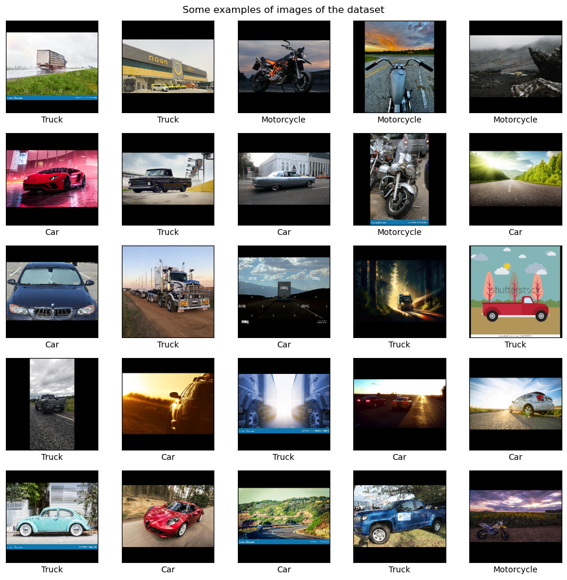

# Vehicle Image Classification Using Transfer Learning with Data Collection and Augmentation

## Introduction
This project focuses on classifying vehicle images into three categories: cars, motorcycles, and trucks. The project involves three main phases: data collection, data augmentation, and transfer learning using ResNet50. The objective is to achieve high classification accuracy by leveraging pre-trained deep learning models and robust data augmentation techniques.

## Data Collection

### Overview

The data collection phase involves downloading images from the web using the DuckDuckGo Search API. Specific search terms were defined for each vehicle category to ensure a diverse set of images.

### Steps Taken

1. **Define Search Terms**:
    - Search terms were specified for each vehicle category and lighting condition to ensure a diverse set of images. For example:
        - Vehicles: "Car", "Truck", "Motorcycle"
        - Lighting Conditions: "photo", "daytime photo", "afternoon photo", "sun photo", "sunny day photo", "bright sun photo", "sunlight photo", "noon photo", "evening photo", "dusk photo", "dawn photo", "overcast photo", "cloudy photo"

2. **Search and Download Images**:
    - A function was used to search for images and return URLs.
    - Another function downloaded images from the URLs, handling errors and saving the images locally.

3. **Directory Structure**:
    - Images were organized into directories based on their categories, e.g., 'car', 'motorcycle', 'truck'.

4. **Collected Images**:
    - A total of 2088 images were collected across the three classes: car, motorcycle, and truck.
    - The collected images are shown below:

## Data Augmentation and Preprocessing

### Overview

After collecting the images, the next phase involved preprocessing and augmenting the data to increase the diversity and robustness of the training dataset.

### Steps Taken

1. **Image Resizing and Padding**:
    - Images were resized and padded to ensure they are of uniform size (224x224 pixels).

2. **Label Encoding**:
    - Labels were encoded into numerical values using `LabelEncoder`.

3. **Train-Test Split**:
    - The dataset was split into training (85%) and testing (15%) sets.

4. **Data Augmentation**:
    - Augmentation techniques included random horizontal flips, rotations, scaling, translations, and brightness/contrast adjustments.
    - Each training image was augmented twice, tripling the size of the training dataset.
    - The augmented images are shown below:

## Transfer Learning

### Using ResNet50 for Transfer Learning

1. **Model Definition**:
    - The base model was set to `ResNet50` pre-trained on ImageNet, excluding the top classification layer.
    - Custom layers were added on top of the base model for classification.

2. **Model Freezing and Compilation**:
    - Initially, all layers of the base model were frozen.
    - The model was compiled with a low learning rate and trained on the augmented dataset.
    - Early stopping was implemented to prevent overfitting.

3. **Model Evaluation**:
    - The model was evaluated on the test set, and metrics such as accuracy, precision, recall, and F1 score were calculated.
    - The predicted images with their classes are shown below:

## Results

The results of the model evaluation on the test set are as follows:

- **Accuracy**: 87.713%
- **Precision**: 87.626%
- **Recall**: 87.756%
- **F1 Score**: 87.660%

### Detailed Classification Report:

| Class       | Precision | Recall | F1-Score | Support |
|-------------|-----------|--------|----------|---------|
| Cars        | 0.83      | 0.84   | 0.83     | 93      |
| Motorcycles | 0.90      | 0.94   | 0.92     | 95      |
| Trucks      | 0.90      | 0.86   | 0.88     | 105     |
| **Accuracy**|           |        | 0.88     | 293     |
| **Macro Avg**| 0.88     | 0.88   | 0.88     | 293     |
| **Weighted Avg**| 0.88  | 0.88   | 0.88     | 293     |

## Conclusion

The project successfully implemented a vehicle image classification system using transfer learning with ResNet50. The system achieved an overall accuracy of 87.713%, with strong precision, recall, and F1 scores across all classes. The combination of robust data collection, augmentation, and transfer learning techniques contributed to the high performance of the model. Future improvements could include collecting more diverse images and experimenting with different pre-trained models and augmentation techniques.
